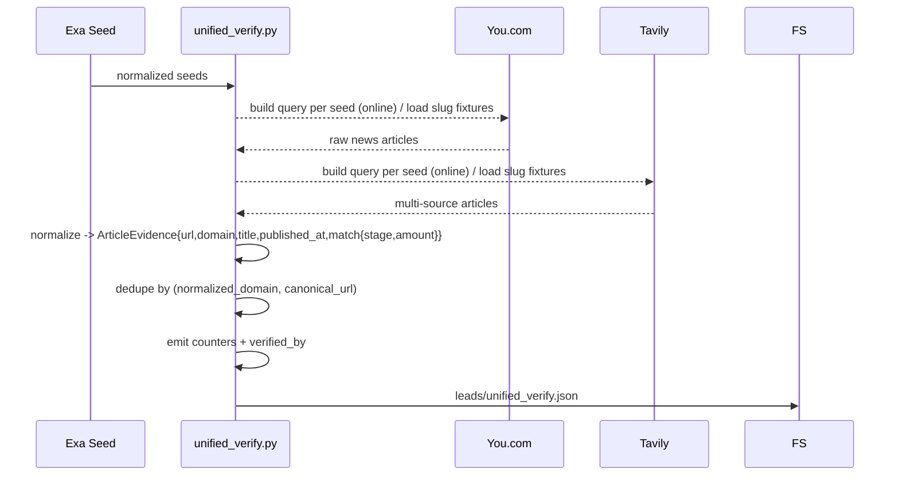
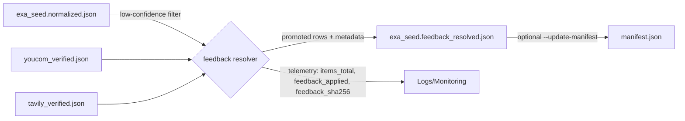

## Verification Pipeline Overview

The Day-1 pipeline now promotes a deterministic normalization pass ahead of the unified You.com/Tavily verification:

```mermaid
flowchart LR
    A[raw/exa_seed.jsonl.gz] --> B[`tools.normalize_exa_seed`]
    B -->|`leads/exa_seed.normalized.json`| C[Unified Verify (SCV-003)]
    C -->|`leads/unified_verify.json`| D[confidence_scoring_v2]
    C --> M[Metrics + Explainability]
```

1. **Exa capture** writes `raw/exa_seed.jsonl.gz`.
2. **`tools.normalize_exa_seed`** converts each noisy item into `{company_name, funding_stage, amount, announced_date, source_url}` tuples.
3. **`pipelines.day1.unified_verify`** fans out to You.com + Tavily (online) or their fixtures (fixture mode), normalizes article evidence, deduplicates domains, emits attribution/metrics, and persists `leads/unified_verify.json`.
4. **`pipelines.day1.confidence_scoring_v2`** deterministically scores each lead from the unified artifact.

### Unified cross-verification (SCV-003)



Key behaviors:

- **Normalization** – `tools.normalize_exa_seed` now applies a deterministic, rules-driven extractor (regex → publisher split → URL slug) governed by `configs/normalizer_rules.v1.yaml`. Each row includes `extraction_method`, the output JSON surfaces `ruleset_version` + `ruleset_sha256`, and INFO logs emit metrics such as `publisher_flagged`, `publisher_split_used`, and `url_slug_used`. The YAML defines verbs, delimiters, publisher keywords/domains, slug stopwords, and whitelisted company domains so tuning never requires code changes.
- **Ruleset config (`configs/normalizer_rules.v1.yaml`)** – structure:
  ```yaml
  version: v1
  verbs: [raises, raised, …]
  delimiters: [" | ", " - ", " — ", " – ", ": ", ":"]
  publisher_keywords: [news, weekly, report, …]
  publisher_domains: [thesaasnews.com, saasweekly.com]
  slug_stopwords: [news, funding, round, series-a, …]
  company_domain_exceptions: [appy.ai, openai.com, uipath.com]
  ```
  Updating these values changes behavior without touching code; the normalizer logs the ruleset SHA for auditability.
- **Matching** – An article is considered *confirming* only when it mentions the seed’s company name and matches either the normalized stage or funding amount tokens. Non-confirming items remain in `confirmations.<source>[]` but do not count toward metrics/`verified_by`.
- **Deduplication** – `articles_all` is deduped by `(normalized_domain, canonical_url)` while per-source arrays remain intact for explainability.
- **Attribution** – `verified_by` always starts with `["Exa"]` and only appends `["You.com","Tavily"]` when that source contributed ≥1 confirming article (stage or amount match).
- **Observability** – The pipeline logs `youcom_hits`, `tavily_hits`, `unique_domains_total`, and `unique_domains_by_source` and persists them under `payload.metrics` for downstream monitoring.
- **Determinism** – Pin `generated_at` / `scored_at` to the bundle capture timestamp (or supply `--timestamp` / `FUND_SIGNAL_BUNDLE_TIMESTAMP`) so SHA comparisons remain meaningful even when CLI calls pass explicit artifact paths; when neither a bundle nor override exists (ad-hoc JSON) the CLIs fall back to `datetime.now()` and determinism depends on the caller providing the override.
- **Resilience** – Fixture loads / API calls are wrapped so source failures log warnings and the pipeline continues with remaining evidence. Fixture mode never issues network requests.

When running `pipelines.day1.unified_verify` manually against ad-hoc files, pass `--timestamp 2025-11-09T06:54:32Z` (or set `FUND_SIGNAL_BUNDLE_TIMESTAMP`) to lock `generated_at` so repeated runs produce identical SHAs.

#### `leads/unified_verify.json` schema

```jsonc
{
  "unified_verify_version": "1.0.0",
  "generated_at": "2025-11-09T06:54:32Z",
  "bundle_id": "bundle-20251109T065356Z",
  "metrics": {
    "youcom_hits": 12,
    "tavily_hits": 14,
    "unique_domains_total": 18,
    "unique_domains_by_source": {"youcom": 10, "tavily": 14}
  },
  "leads": [
    {
      "id": "acme-ai",
      "company_name": "Acme AI",
      "normalized": {
        "stage": "Series A",
        "amount": {"value": 8, "unit": "M", "currency": "USD"},
        "announced_date": "2025-10-15",
        "source_url": "https://exa.example/acme",
        "raw_title": "...",
        "raw_snippet": "..."
      },
      "confirmations": {
        "youcom": [
          {
            "url": "https://techcrunch.com/acme-series-a",
            "domain": "techcrunch.com",
            "title": "Acme AI raises $8M Series A",
            "published_at": "2025-10-15T00:00:00Z",
            "match": {"stage": true, "amount": true}
          }
        ],
        "tavily": [
          {
            "url": "https://www.businesswire.com/news/...",
            "domain": "businesswire.com",
            "title": "BusinessWire: Acme AI completes Series A",
            "published_at": null,
            "match": {"stage": true, "amount": false}
          }
        ]
      },
      "articles_all": [
        {"url": "https://techcrunch.com/acme-series-a", "domain": "techcrunch.com"},
        {"url": "https://www.businesswire.com/news/...", "domain": "businesswire.com"}
      ],
      "unique_domains_total": 2,
      "unique_domains_by_source": {"youcom": 1, "tavily": 2},
      "verified_by": ["Exa", "You.com", "Tavily"]
    }
  ]
}
```

Field notes:

| Field | Description |
| --- | --- |
| `unified_verify_version` | Deterministic format id (currently `"1.0.0"`). |
| `metrics.youcom_hits / tavily_hits` | Count of confirming articles (stage or amount match) contributed by each source across the bundle. |
| `metrics.unique_domains_total` | Total unique domains across all confirming articles (You.com + Tavily). |
| `metrics.unique_domains_by_source` | Unique domain counts attributed per source. |
| `leads[].confirmations.<source>[]` | Normalized `ArticleEvidence` payloads (URL, normalized domain, title, ISO timestamp when provided, match booleans). |
| `leads[].articles_all` | Deduped union of confirming articles across sources, ordered by source priority. |
| `leads[].unique_domains_*` | Per-lead aggregates derived from confirming article sets. |
| `leads[].verified_by` | Explainability list surfaced in the UI drawer (`Exa` + verifying sources). |

### Running the normalizer

```bash
export FUND_SIGNAL_MODE=fixture
export FUND_SIGNAL_SOURCE=local

python -m tools.normalize_exa_seed \
  --input artifacts/<bundle>/raw/exa_seed.jsonl.gz \
  --output artifacts/<bundle>/leads/exa_seed.normalized.json
```

The command accepts JSON arrays, JSON Lines, or `.jsonl.gz` files. The output includes:

```json
{
  "normalizer_version": "2.0.0",
  "ruleset_version": "v1",
  "ruleset_sha256": "<sha of configs/normalizer_rules.v1.yaml>",
  "items_total": 71,
  "items_parsed": 52,
  "items_skipped": 19,
  "coverage_by_field": {
    "company_name": 52,
    "funding_stage": 52,
    "amount": 52,
    "announced_date": 18
  },
  "metrics": {
    "publisher_flagged": 12,
    "publisher_split_used": 10,
    "url_slug_used": 4,
    "final_accepted": 52
  },
  "data": [...],
  "skipped": [
    {"line_number": 14, "skip_reason": "MISSING_COMPANY", "raw_title": "Seed Round | The SaaS News"}
  ]
  }
```

### Candidate generator (FSQ-002)

The candidate generator separates high-recall name extraction from downstream resolution. It reads the raw Exa seeds and emits multiple deterministic candidates per row, along with provenance and telemetry.

```bash
export FUND_SIGNAL_MODE=fixture
export FUND_SIGNAL_SOURCE=local

python -m tools.candidate_generator \
  --input artifacts/<bundle>/raw/exa_seed.jsonl.gz \
  --rules configs/normalizer_rules.v1.yaml \
  --output artifacts/<bundle>/leads/exa_seed.candidates.json
```

The output payload is deterministic (same bundle + ruleset → same SHA) and includes:

```json
{
  "generator_version": "1.0.0",
  "ruleset_version": "v1",
  "ruleset_sha256": "<sha>",
  "items_total": 76,
  "items_with_candidates": 76,
  "metrics": {
    "publisher_flagged": 12,
    "publisher_split_used": 10,
    "url_slug_used": 68,
    "avg_candidates_per_item": 2.1
  },
  "data": [
    {
      "id": "row_000123",
      "raw_title": "The SaaS News | Appy.ai raises $10M Series A",
      "source_url": "https://www.thesaasnews.com/news/appy.ai-raises-10m",
      "features": {"publisher_flagged": true, "publisher_split_used": true, "url_slug_used": true},
      "candidates": ["Appy.ai", "Appy"],
      "extraction_methods": {"Appy.ai": "url_slug", "Appy": "title_regex"},
      "candidate_features": {
        "Appy.ai": {"possessive_plural_repaired": false},
        "Appy": {"possessive_plural_repaired": false}
      },
      "ruleset_version": "v1",
      "ruleset_sha256": "<sha>",
      "generator_version": "1.0.0"
    }
  ],
  "skipped": []
}
```

`tools.candidate_generator` logs counters (`items_total`, `items_with_candidates`, `publisher_flagged`, `publisher_split_used`, `url_slug_used`, `avg_candidates_per_item`) so drift is visible in Render/Cloud logs. Each candidate undergoes light normalization (Unicode NFKC, possessive/plural cleanup, token cap ≤6, vowel check) while preserving dotted brands (e.g., `Appy.ai`) and records deterministic metadata in `candidate_features` (e.g., whether possessive repair occurred). Downstream resolver tasks can then deterministically choose the best company name without bloated heuristics in this stage.

### Resolver ruleset (FSQ-003)

Resolver scoring/selection logic lives in versioned YAML (`configs/resolver_rules.v1.1.yaml`). The loader (`python -m tools.resolver_rules --rules configs/resolver_rules.v1.1.yaml --print-sha`) validates the schema, computes a canonical SHA, and surfaces:

```
{
  "version": "v1.1",
  "weights": {
    "no_funding_tokens": 4,
    "token_count_1_3": 2,
    "proper_noun_or_dotted": 3,
    "close_to_slug_head": 1,
    "slug_head_proximity_bonus": 1,
    "near_funding_verb": 2,
    "locale_verb_hit": 2,
    "possessive_plural_repaired": 1,
    "has_funding_token": -4,
    "has_publisher_token_or_domain": -4,
    "has_publisher_prefix": -2,
    "starts_with_verb_or_gerund": -2,
    "long_phrase_penalty": -2
  },
  "tie_breakers": [
    "score_desc",
    "token_count_asc",
    "appears_in_title_first",
    "lexicographic_ci"
  ],
  "slug_head_edit_distance_threshold": 2,
  "token_limits": {"max_tokens": 6, "min_tokens": 1},
  "ruleset_sha256": "490356d1cfa7ecd84cf13a197768a1c5012d41c878f19ebab7aad6c9ad8bdd4a"
}
```

Any schema violation (missing fields, unsupported tie breaker, negative thresholds) raises `ResolverRulesError` with code `RULES_SCHEMA_INVALID`. Hashing uses sorted JSON dumps to guarantee determinism; the Resolver embeds `ruleset_version` + `ruleset_sha256` (v1.1 hash `490356d1cfa7ecd84cf13a197768a1c5012d41c878f19ebab7aad6c9ad8bdd4a`) in its outputs so scoring decisions stay auditable. v1.1 now records per-candidate `feature_flags` (publisher prefixes, verb/gerund starters, slug-head proximity, locale verb hits, possessive repairs) and the candidate generator persists matching `candidate_features`, enabling troubleshooting without touching runtime heuristics.

> **Resolver v1.1 rollout (2025‑11‑11)**  
> - Added publisher prefix penalty + verb/gerund opener penalty to demote publisher headlines.  
> - Introduced slug-head proximity bonus and locale verb hits (e.g., *erhält*, *obtiene*) to boost real company spans even in non-English copy.  
> - Propagated possessive/plural repair metadata from the generator so the resolver can up-rank cleaned candidates.  
> Verify your environment by checking `resolver_ruleset_version`/`resolver_ruleset_sha256` in resolver telemetry logs or by running `python -m tools.resolve_company_name --input … --output … --rules configs/resolver_rules.v1.1.yaml` and confirming the printed SHA matches the value above.

### Deterministic resolver (FSQ-004)

The resolver consumes `exa_seed.candidates.json`, loads the resolver ruleset, and deterministically emits a single `company_name` per row:

```bash
python -m tools.resolve_company_name \
  --input artifacts/<bundle>/leads/exa_seed.candidates.json \
  --rules configs/resolver_rules.v1.1.yaml \
  --out artifacts/<bundle>/leads/exa_seed.normalized.json
```

Scoring signals (weights pulled from the YAML):

| Feature | Description | Weight |
| --- | --- | --- |
| `no_funding_tokens` | Candidate does **not** contain tokens like `seed/series/funding/round`. | +4 |
| `token_count_1_3` | Tokenized length between 1–3 inclusive. | +2 |
| `proper_noun_or_dotted` | Contains dotted brand (`Appy.ai`) or capitalized tokens. | +3 |
| `close_to_slug_head` | Levenshtein distance to URL slug head ≤ threshold (default 2). | +1 |
| `slug_head_proximity_bonus` | Extra boost scaled by `(threshold + 1) − distance` (0 when outside range). | +1 |
| `near_funding_verb` | Candidate appears near verbs such as “raises/announces”. | +2 |
| `locale_verb_hit` | Locale verb (e.g., “erhält”, “obtiene”) appears near the candidate span. | +2 |
| `possessive_plural_repaired` | Generator trimmed possessive/plural suffixes to reach this candidate. | +1 |
| `has_funding_token` | Contains `seed/series/round/funding` style gerunds. | −4 |
| `has_publisher_token_or_domain` | Matches publisher keywords/domains (News, Digest, etc.). | −4 |
| `has_publisher_prefix` | Begins with publisher/article prefix (e.g., “The SaaS News”). | −2 |
| `starts_with_verb_or_gerund` | Candidate itself begins with verbs/gerunds (“Raises”, “Securing”). | −2 |
| `long_phrase_penalty` | ≥5 tokens. | −2 |

Tie-breakers (`resolver_rules.v1.1.yaml`): `score_desc → token_count_asc → appears_in_title_first → lexicographic_ci`.

Resolver output example:

```json
{
  "resolver_version": "1.0.0",
  "resolver_ruleset_version": "v1.1",
  "resolver_ruleset_sha256": "490356d1cfa7ecd84cf13a197768a1c5012d41c878f19ebab7aad6c9ad8bdd4a",
  "items_total": 76,
  "items_resolved": 75,
  "items_skipped": 1,
  "data": [
    {
      "id": "row_000123",
      "company_name": "Appy.ai",
      "resolution": {
        "method": "resolver_v1.1",
        "chosen_idx": 0,
        "score": 7.0,
        "candidates": ["Appy.ai","Appy","Seed Round"],
        "scores": [7.0,4.0,-5.0],
        "feature_flags": [
          {
            "candidate": "Appy.ai",
            "signals": {
              "no_funding_tokens": true,
              "token_count_1_3": true,
              "slug_head_edit_distance": 0,
              "slug_head_proximity_bonus": 3,
              "near_funding_verb": true,
              "has_publisher_prefix": false
            }
          }
        ]
      },
      "resolver_ruleset_version": "v1.1",
      "resolver_ruleset_sha256": "490356d1cfa7ecd84cf13a197768a1c5012d41c878f19ebab7aad6c9ad8bdd4a",
      "generator_ruleset_version": "v1",
      "generator_ruleset_sha256": "<sha>"
    }
  ],
  "skipped": [
    {"id": "row_000200", "skip_reason": "EMPTY_CANDIDATES_AFTER_FILTER"}
  ]
}
```

Logs include `items_total`, `items_resolved`, `avg_candidates_per_item`, score distribution, and the embedded ruleset SHA so any regression is traceable. Running the resolver twice with the same inputs and ruleset yields byte-identical outputs/SHA, satisfying the determinism requirement.

### Telemetry & logging

All three stages (generator, resolver, normalize_and_resolve) emit JSON-friendly telemetry via `tools.telemetry`:

```json
{
  "timestamp": "2025-11-11T09:15:00Z",
  "module": "normalize_and_resolve",
  "event": "summary",
  "elapsed_ms": 2140,
  "generator": {
    "ruleset_version": "v1",
    "ruleset_sha256": "sha256:…",
    "metrics": {"items_total": 71, "items_with_candidates": 71, "avg_candidates_per_item": 2.3, "publisher_flagged": 9}
  },
  "resolver": {
    "ruleset_version": "v1.1",
    "ruleset_sha256": "490356d1cfa7ecd84cf13a197768a1c5012d41c878f19ebab7aad6c9ad8bdd4a",
    "metrics": {"items_total": 71, "items_resolved": 71, "items_skipped": 0},
    "accuracy_estimate": 0.96
  }
}
```

Configuration keys:

| Env Var | Description | Default |
| --- | --- | --- |
| `LOG_LEVEL` | Python logging level. | `INFO` |
| `TELEMETRY_FORMAT` | `json` or `text` output. | `text` |
| `TELEMETRY_PATH` | Optional log file path for telemetry events. | *(stdout only)* |

CI tests (`tests/test_telemetry.py`) ensure telemetry writes structured records and never leaks secrets. Use these metrics (recall, resolution, elapsed_ms, ruleset SHAs) to confirm determinism and accuracy for every bundle run.

### Feedback loop (FSQ-008)

After generator → resolver, an optional deterministic feedback resolver can patch low-confidence rows using You.com/Tavily evidence:



```bash
python -m tools.verify_feedback_resolver \
  --input artifacts/<bundle>/leads/exa_seed.normalized.json \
  --youcom artifacts/<bundle>/leads/youcom_verified.json \
  --tavily artifacts/<bundle>/leads/tavily_verified.json \
  --out artifacts/<bundle>/leads/exa_seed.feedback_resolved.json \
  --update-manifest artifacts/<bundle>/manifest.json
```

Correction rules:

1. Only rows with `resolution.final_label == "EXCLUDE"` or `resolution.score < 2` are eligible.
2. Articles are scanned for capitalized spans (1–3 tokens) that appear across ≥2 unique domains.
3. Spans containing publisher/stopword tokens are ignored; ties break by domain count → token count → lexicographic order.
4. When promoted, rows gain `feedback_applied`, `feedback_reason`, `feedback_domains`, `feedback_version` (`v1`), and `feedback_sha256`. The overall payload records the same version + SHA (calculated over `data[]`), and the optional `--update-manifest` flag rewrites `leads/exa_seed.feedback_resolved.json`'s checksum entry so auditors can verify bundle integrity.

Telemetry emitted via `feedback_resolver` logs: `items_total`, `feedback_applied`, `feedback_candidates_checked`, `unique_spans_found`, and the deterministic `feedback_sha256`. See `tests/fixtures/bundles/feedback_case` for the curated evidence used in CI tests.

**Operational checklist**

- [ ] Ensure the bundle already contains `leads/youcom_verified.json` + `leads/tavily_verified.json`.
- [ ] Run in fixture mode locally (`FUND_SIGNAL_MODE=fixture FUND_SIGNAL_SOURCE=local`) unless operating on the capture runner.
- [ ] Capture the new `feedback_sha256` from logs and, if using `--update-manifest`, archive the updated `manifest.json`.
- [ ] Store generated artifacts alongside the original normalized file so Unified Verify / downstream scoring can read whichever version is required.

### When to re-run

- After each Exa capture for nightly bundles.
- Whenever regex rules change—rerun to regenerate canonical seeds before verification.

### Troubleshooting

| Issue | Mitigation |
| -- | -- |
| `MISSING_COMPANY` skips spike | Inspect `skipped` block to confirm article titles can be parsed; adjust regexes if needed. |
| Performance slower than target | Files >5k rows should still complete in <2s on an M2 Pro. Verify you are running from local SSD and not piping through slow network FS. |
| Determinism | Output is fully deterministic. If SHA changes for same input, ensure no timestamps/unstable ordering were added in downstream edits. |

### Programmatic use

Automation steps that need the normalized payload without touching disk can import `normalize_records` from `tools.normalize_exa_seed`. It accepts any iterable of raw Exa rows and returns the same payload structure emitted by the CLI entrypoint, which keeps downstream tests fast while sharing the identical validation logic.

## Deterministic confidence scoring (v2)

The second-stage scorer consumes the unified verification bundle from SCV-003 and emits lead-level points, labels, and observability metadata.

```
python -m pipelines.day1.confidence_scoring_v2 \
  --input artifacts/<bundle>/leads/unified_verify.json \
  --rules configs/verification_rules.v1.yaml \
  --out artifacts/<bundle>/leads/day1_scored.json
```
For manual invocations outside the bundle helpers, supply the same `--timestamp` (or `FUND_SIGNAL_BUNDLE_TIMESTAMP`) used in unified verification so `scored_at` stays fixed between reruns.

### Ruleset + heuristics

- `configs/verification_rules.v1.yaml` is the single source of truth for weights, thresholds, and the “mainstream domains” allowlist. Changing those values requires bumping the version.
- Each lead starts at zero points and gains:
  - `+2` for at least two unique domains from the mainstream list across all confirming articles.
  - `+1` when any confirming article exactly matches the normalized stage or amount.
  - `+1` when both You.com and Tavily each contribute at least one confirming article.
- Labels are derived from the versioned thresholds: `VERIFIED (>=3)`, `LIKELY (>=2)`, `EXCLUDE (<2)`.
- Missing normalized fields or confirmation sources never drop the item; instead, they add entries to `warnings[]` and the lead simply receives zero points for that rule.

### Output contract

`day1_scored.json` is deterministic (same bundle → same SHA) and includes:

```json
{
  "ruleset_version": "v1",
  "ruleset_sha256": "<sha of configs/verification_rules.v1.yaml>",
  "scored_at": "2025-11-07T03:00:00Z",
  "leads": [
    {
      "id": "lead_001",
      "company_name": "Acme AI",
      "confidence_points": 3,
      "final_label": "VERIFIED",
      "verified_by": ["Exa", "You.com", "Tavily"],
      "proof_links": [
        "https://techcrunch.com/...",
        "https://www.businesswire.com/..."
      ],
      "warnings": []
    }
  ]
}
```

`ruleset_version` can be temporarily overridden via `RULES_VERSION_OVERRIDE` for fixture tests, but the SHA always reflects the on-disk config.

### Tests

Use `pytest -k "test_confidence_scoring_v2 or test_rules_determinism or test_rules_backward_compat" -q` to exercise the heuristics plus determinism guarantees. The fixture inputs cover the FSQ-001 scenario: two mainstream confirmations with an exact amount match must score `>=3` and land in `VERIFIED`.
