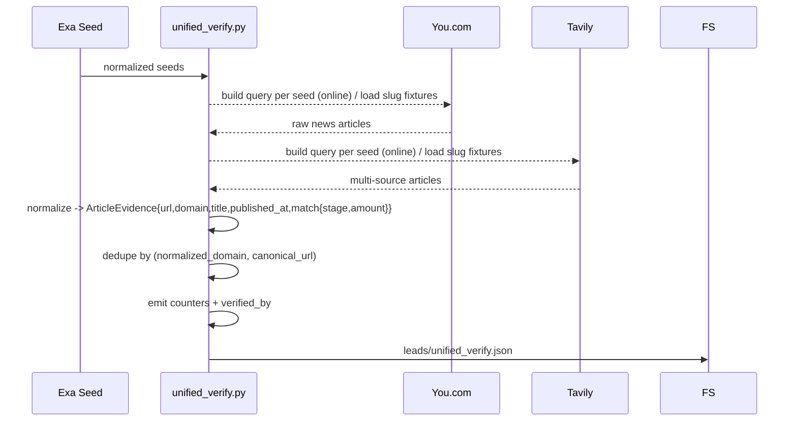

## Verification Pipeline Overview

The Day-1 pipeline now promotes a deterministic normalization pass ahead of the unified You.com/Tavily verification:

```mermaid
flowchart LR
    A[raw/exa_seed.jsonl.gz] --> B[`tools.normalize_exa_seed`]
    B -->|`leads/exa_seed.normalized.json`| C[Unified Verify (SCV-003)]
    C -->|`leads/unified_verify.json`| D[confidence_scoring_v2]
    C --> M[Metrics + Explainability]
```

1. **Exa capture** writes `raw/exa_seed.jsonl.gz`.
2. **`tools.normalize_exa_seed`** converts each noisy item into `{company_name, funding_stage, amount, announced_date, source_url}` tuples.
3. **`pipelines.day1.unified_verify`** fans out to You.com + Tavily (online) or their fixtures (fixture mode), normalizes article evidence, deduplicates domains, emits attribution/metrics, and persists `leads/unified_verify.json`.
4. **`pipelines.day1.confidence_scoring_v2`** deterministically scores each lead from the unified artifact.

### Unified cross-verification (SCV-003)



Key behaviors:

- **Normalization** – `article_normalizer` slugifies each seed (fixture lookup), canonicalizes URLs, strips tracking params, and collapses domains with public-suffix aware logic (e.g., `news.bbc.co.uk → bbc.co.uk`).
- **Matching** – An article is considered *confirming* only when it mentions the seed’s company name and matches either the normalized stage or funding amount tokens. Non-confirming items remain in `confirmations.<source>[]` but do not count toward metrics/`verified_by`.
- **Deduplication** – `articles_all` is deduped by `(normalized_domain, canonical_url)` while per-source arrays remain intact for explainability.
- **Attribution** – `verified_by` always starts with `["Exa"]` and only appends `["You.com","Tavily"]` when that source contributed ≥1 confirming article (stage or amount match).
- **Observability** – The pipeline logs `youcom_hits`, `tavily_hits`, `unique_domains_total`, and `unique_domains_by_source` and persists them under `payload.metrics` for downstream monitoring.
- **Resilience** – Fixture loads / API calls are wrapped so source failures log warnings and the pipeline continues with remaining evidence. Fixture mode never issues network requests.

#### `leads/unified_verify.json` schema

```jsonc
{
  "unified_verify_version": "1.0.0",
  "generated_at": "2025-11-09T06:54:32Z",
  "bundle_id": "bundle-20251109T065356Z",
  "metrics": {
    "youcom_hits": 12,
    "tavily_hits": 14,
    "unique_domains_total": 18,
    "unique_domains_by_source": {"youcom": 10, "tavily": 14}
  },
  "leads": [
    {
      "id": "acme-ai",
      "company_name": "Acme AI",
      "normalized": {
        "stage": "Series A",
        "amount": {"value": 8, "unit": "M", "currency": "USD"},
        "announced_date": "2025-10-15",
        "source_url": "https://exa.example/acme",
        "raw_title": "...",
        "raw_snippet": "..."
      },
      "confirmations": {
        "youcom": [
          {
            "url": "https://techcrunch.com/acme-series-a",
            "domain": "techcrunch.com",
            "title": "Acme AI raises $8M Series A",
            "published_at": "2025-10-15T00:00:00Z",
            "match": {"stage": true, "amount": true}
          }
        ],
        "tavily": [
          {
            "url": "https://www.businesswire.com/news/...",
            "domain": "businesswire.com",
            "title": "BusinessWire: Acme AI completes Series A",
            "published_at": null,
            "match": {"stage": true, "amount": false}
          }
        ]
      },
      "articles_all": [
        {"url": "https://techcrunch.com/acme-series-a", "domain": "techcrunch.com"},
        {"url": "https://www.businesswire.com/news/...", "domain": "businesswire.com"}
      ],
      "unique_domains_total": 2,
      "unique_domains_by_source": {"youcom": 1, "tavily": 2},
      "verified_by": ["Exa", "You.com", "Tavily"]
    }
  ]
}
```

Field notes:

| Field | Description |
| --- | --- |
| `unified_verify_version` | Deterministic format id (currently `"1.0.0"`). |
| `metrics.youcom_hits / tavily_hits` | Count of confirming articles (stage or amount match) contributed by each source across the bundle. |
| `metrics.unique_domains_total` | Total unique domains across all confirming articles (You.com + Tavily). |
| `metrics.unique_domains_by_source` | Unique domain counts attributed per source. |
| `leads[].confirmations.<source>[]` | Normalized `ArticleEvidence` payloads (URL, normalized domain, title, ISO timestamp when provided, match booleans). |
| `leads[].articles_all` | Deduped union of confirming articles across sources, ordered by source priority. |
| `leads[].unique_domains_*` | Per-lead aggregates derived from confirming article sets. |
| `leads[].verified_by` | Explainability list surfaced in the UI drawer (`Exa` + verifying sources). |

### Running the normalizer

```bash
export FUND_SIGNAL_MODE=fixture
export FUND_SIGNAL_SOURCE=local

python -m tools.normalize_exa_seed \
  --input artifacts/<bundle>/raw/exa_seed.jsonl.gz \
  --output artifacts/<bundle>/leads/exa_seed.normalized.json
```

The command accepts JSON arrays, JSON Lines, or `.jsonl.gz` files. The output includes:

```json
{
  "normalizer_version": "1.0.0",
  "items_total": 71,
  "items_parsed": 52,
  "items_skipped": 19,
  "coverage_by_field": {
    "company_name": 52,
    "funding_stage": 52,
    "amount": 52,
    "announced_date": 18
  },
  "data": [...],
  "skipped": [
    {"line_number": 14, "skip_reason": "MISSING_COMPANY", "raw_title": "Seed Round | The SaaS News"}
  ]
}
```

### When to re-run

- After each Exa capture for nightly bundles.
- Whenever regex rules change—rerun to regenerate canonical seeds before verification.

### Troubleshooting

| Issue | Mitigation |
| -- | -- |
| `MISSING_COMPANY` skips spike | Inspect `skipped` block to confirm article titles can be parsed; adjust regexes if needed. |
| Performance slower than target | Files >5k rows should still complete in <2s on an M2 Pro. Verify you are running from local SSD and not piping through slow network FS. |
| Determinism | Output is fully deterministic. If SHA changes for same input, ensure no timestamps/unstable ordering were added in downstream edits. |

### Programmatic use

Automation steps that need the normalized payload without touching disk can import `normalize_records` from `tools.normalize_exa_seed`. It accepts any iterable of raw Exa rows and returns the same payload structure emitted by the CLI entrypoint, which keeps downstream tests fast while sharing the identical validation logic.

## Deterministic confidence scoring (v2)

The second-stage scorer consumes the unified verification bundle from SCV-003 and emits lead-level points, labels, and observability metadata.

```
python -m pipelines.day1.confidence_scoring_v2 \
  --input artifacts/<bundle>/leads/unified_verify.json \
  --rules configs/verification_rules.v1.yaml \
  --out artifacts/<bundle>/leads/day1_scored.json
```

### Ruleset + heuristics

- `configs/verification_rules.v1.yaml` is the single source of truth for weights, thresholds, and the “mainstream domains” allowlist. Changing those values requires bumping the version.
- Each lead starts at zero points and gains:
  - `+2` for at least two unique domains from the mainstream list across all confirming articles.
  - `+1` when any confirming article exactly matches the normalized stage or amount.
  - `+1` when both You.com and Tavily each contribute at least one confirming article.
- Labels are derived from the versioned thresholds: `VERIFIED (>=3)`, `LIKELY (>=2)`, `EXCLUDE (<2)`.
- Missing normalized fields or confirmation sources never drop the item; instead, they add entries to `warnings[]` and the lead simply receives zero points for that rule.

### Output contract

`day1_scored.json` is deterministic (same bundle → same SHA) and includes:

```json
{
  "ruleset_version": "v1",
  "ruleset_sha256": "<sha of configs/verification_rules.v1.yaml>",
  "scored_at": "2025-11-07T03:00:00Z",
  "leads": [
    {
      "id": "lead_001",
      "company_name": "Acme AI",
      "confidence_points": 3,
      "final_label": "VERIFIED",
      "verified_by": ["Exa", "You.com", "Tavily"],
      "proof_links": [
        "https://techcrunch.com/...",
        "https://www.businesswire.com/..."
      ],
      "warnings": []
    }
  ]
}
```

`ruleset_version` can be temporarily overridden via `RULES_VERSION_OVERRIDE` for fixture tests, but the SHA always reflects the on-disk config.

### Tests

Use `pytest -k "test_confidence_scoring_v2 or test_rules_determinism or test_rules_backward_compat" -q` to exercise the heuristics plus determinism guarantees. The fixture inputs cover the FSQ-001 scenario: two mainstream confirmations with an exact amount match must score `>=3` and land in `VERIFIED`.
